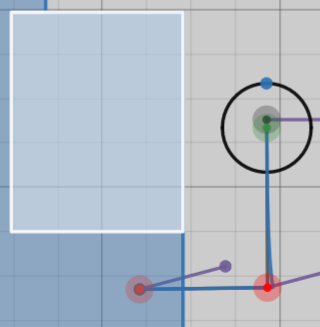

# The AlignCharger() Procedure

## What is AlignCharger?

AlignCharger is a procedure that automatically moves the robot to the charging station so it can easily be balanced.

## How does AlignCharger work?

AlignCharger uses the ChargeStationPathFinder object, which takes the alliance color and constants of the location of each charging station. It creates an ArrayList of pointDir objects, and adds a number of points to this list that allow the robot to reach the center of the charging station.

## Paramaters and Path

The path that the robot takes is determined as follows:
* If and only if the robot is directly under or over its charge station, set a point at (x = `THRESHOLD` away from nearest charge station edge, y = current Y value) so that it will be able to move directly up.
* Set a point at (x = `THRESHOLD` away from charge station edge, y = `MIDDLE` of charge station)

The returned list is passed as a paramater to the FollowPoints procedure.

The image below shows an example of a path in which the robot starts below the charge station.

## Initialization

There is one constructor for AlignCharger():
* An enum Alliance (which can be passed through DriverStation.getAlliance()) will set the Alliance `alliance`