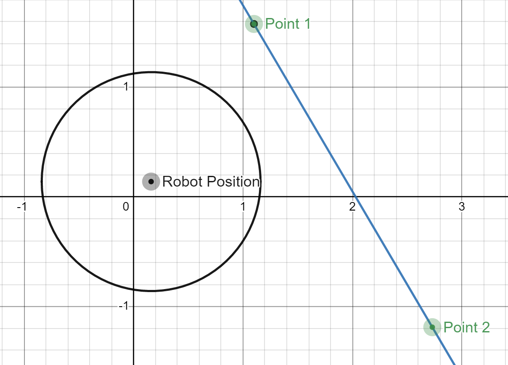
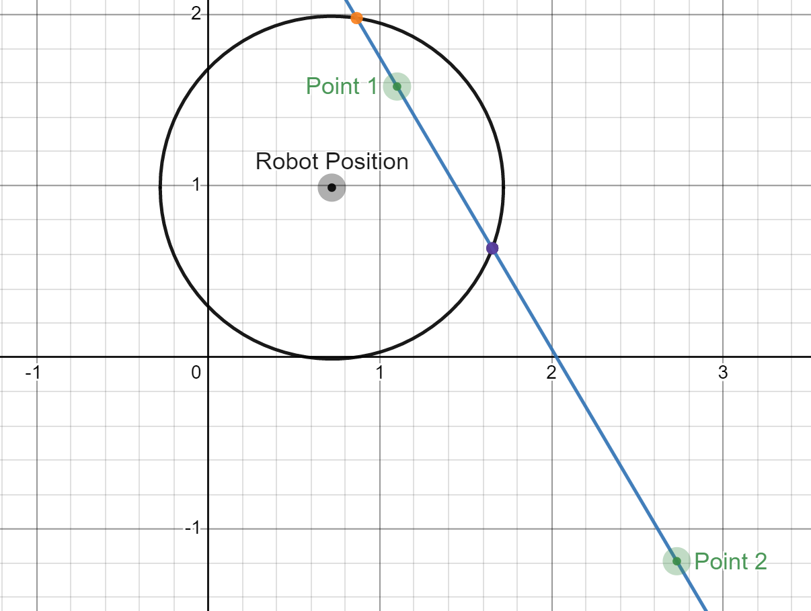
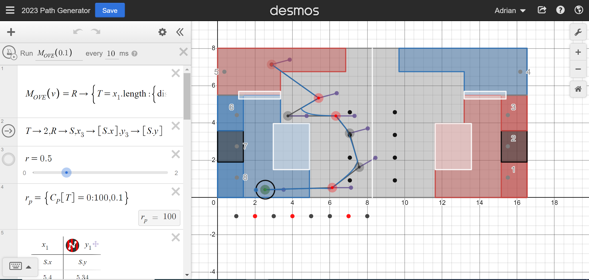

# The FollowPoints() Procedure

## What is FollowPoints?

FollowPoints is a procdure in which the robot follows a path of points. It does not find the robot's position, but utilizes another position-finding system (such as odometry).

## How does FollowPoints work?

FollowPoints utilizes the "Pure Pursuit" method. This method involves a circle drawn around the robot.

At the start of the method, the robot moves towards the first point. In th above image, the robot would move towards Point 1.

Once the circle around the robot intersects the line between Points 1 and 2, the robot starts to move toward the point where this line intersects the circle. In the image above, this is the purple point (the orange point is also a place where the circle and line intersect, but the robot will move towards the intersection point closest to Point 2). The robot will continue moving towards this point, moving closer to the line, until it reaches the line between Points 2 and 3, when it will start to follow that line. This procedure ensures the robot travels along a smooth curve.

## FollowPoints Customization Options

### Critical Points

Though it allows for a smooth curve, Pure Pursuit means that the robot won't actually reach any of the points, and will instead curve around them. It also means that if there are three consecutive and near-colinear points, the method will bypass the second point, as the robot will immediately intersect the line between the second  and third points.

To remedy this, the `FollowPoints()` procedure allows for points to be specified as "critical points." The robot must reach a critical point before moving to the next point. The last point in a `FollowPoints()` procedure is always treated as a critical point, no matter if it is actually specified as one.

### Headers

All points are inputted as `PointDir` objects, which contain a header as an argument. The robot will rotate so it is facing the header of the point it is moving towards.

### Procedures

Optionally, an array of procedures may be provided as an input. If given, once the robot reaches a given point (or starts moving towards the next point in the case the point is not a critical point), it will run that procedure. The boolean `stopRobot` determines whether the robot will stop and wait for the procedure to finish before continuing.

## Desmos Integration

For the 2023 season, FollowPoints has been integrated with [the Desmos model of the field](https://www.desmos.com/calculator/wsfoybrano).

To use this model, drag the points across the field. To make a point a critical point, click the red/gray dots at the bottom of the field (the first dot corresponds to the first point, the second to the second point, etc.). To change the heading at each point, click on the purple dot attached to each point to rotate it by 15 degrees. The model currently does not support procedures.

To add a new point, add its x- and y-coordinate to the table. Add a 0 or 1 to the c_p list corresponding to if the point is critical, and add an angle measure in degrees to the a list for the heading.

To export the path, open the console (Ctrl+Shift+J), scroll to the bottom of the Desmos equations list and copy-and-paste the code into the console. Copy-and-paste the resulting json format into the deploy folder (C:\Users\admin\Documents\GitHub\2023\src\main\deploy).

## Running FollowPoints()

There are several constructors accepted by FollowPoints():

* An array of PointDirs will provide a path, but will not allow for the specification of procedures or critical points.
* A string with the name of a json file will run the path generated by a Desmos model.
* A default constructor will run a path with provided "Steps," objects containing a PointDir, a "critical point" boolean, a procedure, and a "stop robot at procedure" boolean.

**By default, FollowPoints() is robot-oriented.** To make it field-oriented, all constructors optionally can be given a starting Point. As well as making the procedure field-oriented, this will also set the current robot position to that starting point, which allows for an initial position during auton.
