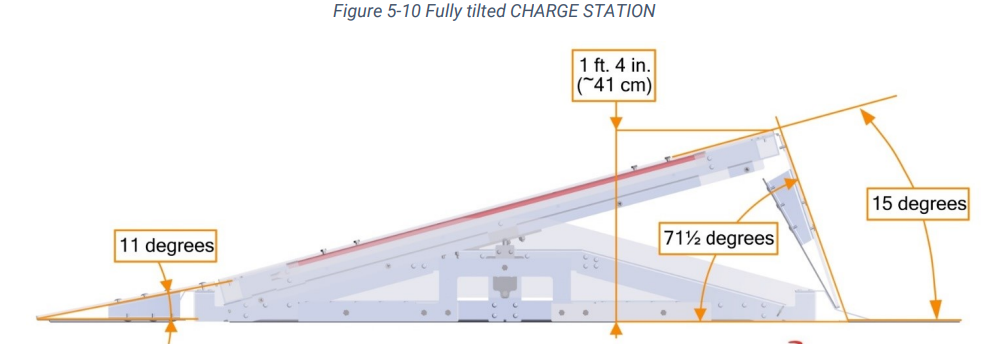

# The GyroBalance() procedure

## What is GyroBalance?

GyroBalance is a procedure that uses gyro values to automatically adjust the robot to the balanced state on the charging station.

## How does GyroBalance work?

GyroBalance uses a state machine to determine the appropirate direction and speed to move the robot, and when to stop. Once the robot reaches the `LEVEL` state, it stops and locks its wheels using the `setCross()` procedure. The states are determined with gyro values, and is almost completely independent from localization, which is only necessary to determine the direction and starting position. Since pitch and roll, the two values that are necessary to find the robot's tilt, are relative to the robot, this procedure uses an absolute tilt level stored in `double tilt` which combines pitch and roll.

## States

The enum `State` has four different values: `GROUND`, `RAMP_TRANSITION`, `RAMP_TILT`, and `RAMP_LEVEL`. 
* `GROUND` is when the robot is on the ground. 
	* It is set if the `curX` position is not on the set alliance's charging station, and if `tilt` is about 0. 
	* The robot speed gets set to `SPEED_GROUND`.
* `RAMP_TRANSITION` is when the robot is going onto the ramp flap from the ground. It is necessary in order to account for an increase and decrease in `tilt` before the `RAMP_TILT` state is reached. 
	* It is set when the `prevState` is `GROUND` and there is an increase in `tilt`. 
	* The robot speed is set to `SPEED_TRANSITION`.
* `RAMP_TILT` is when the robot is driving up the tilted charging station.
	* It is set if the `prevState` is `RAMP_TRANSITION` and `tilt` is about the angle of the tilted ramp.
	* The robot speed is set to `SPEED_TILT`
* `RAMP_LEVEL` is when the robot is level on the charging station.
	* It is set if the `prevState` is `RAMP_TILT` and `tilt` is less than the constant `LEVEL`.
	* The robot speed is set to `-speed` in order to correct for overshooting later.

Below is an image of a tilted charge station and its angles.

The robot then moves towards the ramp at the set `speed`. Once it reaches `RAMP_LEVEL`, it briefly moves backwards in order to correct for overshooting, and crosses its wheels.

## Initialization and tweaking

The `GyroBalance()` constructor has one paramater, which is `alliance`. 

In order to tweak the point that the robot stops and locks its wheels, change the `LEVEL` constant, as a higher value will make it stop sooner and therefore balance quicker but will also make it less consistent. 
Additionally, to adjust speed at certain states, adjust the correspoinding constants. If these values are changed, it might also be necessary to adjust the `CORRECTION_DELAY` to make sure it fully balances.

