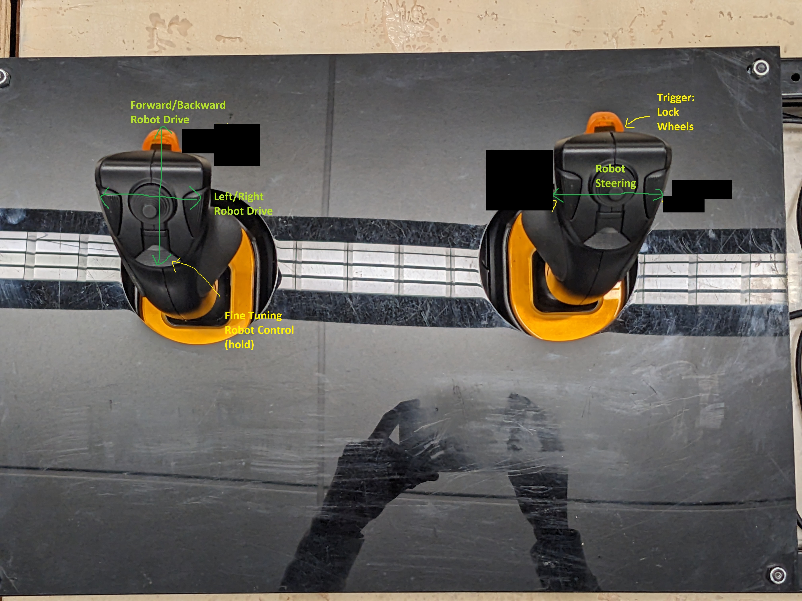

# OI Controls

## Driver Controls
The driver controls the two joysticks on the left of the driver station. The image below shows the controls.

The right trigger locks the robot wheels by crossing them. To get out of the crossed state, move either joystick.
The bottom left joystick button puts the robot into fine tuning mode, and all joystick controls will make the robot move a small amount.

## Box Op Controls
The box op controls are on the farm simulator controller. There are two buttons that will be used during the Sacramento Regional:
* The top right orange button labeled `IN`: holding this will deploy the intake
* The bottom right orange button labled `OUT`: holding this will reverse the intake motors and spit out the held piece. 
* Releasing either button will retract the intake and turn off the motors.