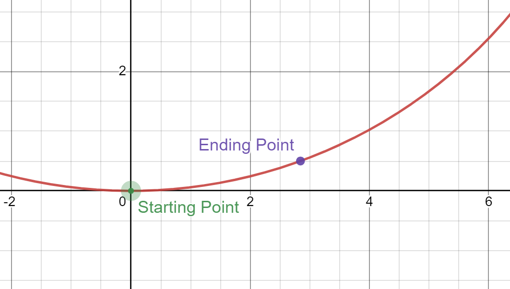
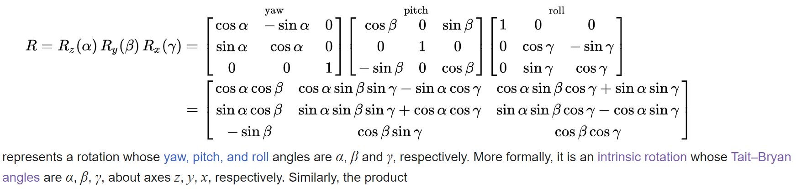

# Odometry

## What is Odometry?

Odometry is a method to calculate the position of the robot based on how far each of the wheels has traveled.

## How does Odometry work?

On a swerve drive-bot, each wheel can both spin and rotate. We use this to estimate where each robot has traveled. Each wheel keeps track of how far it has traveled, as well as its heading, and we use this to calculate the position of each wheel.

Given a wheel's starting position, distance traveled, and angle change, an arc is used to estimate the new x- and y-positions of that wheel. Once positions for all four wheels are calculated, they are averaged to find the new position of the robot.

Recently, odometry code was changed to accomodate for slopes. Instead of using pure equations as before, it now uses a series of transformations to convert the arc into a robot-oriented coordinate system, then a field-oriented coordinate system. This code is based on the rotation matricies shown below.

## Benefits of Odometry

* **It does not require any external hardware.** Odometry is entirely based on the wheels, and does not require any cameras or lights, and so will rarely break. This leaves it as a robust backup in case another position-finding system fails.
* **It works fast.** Odometry can easily run at 100 or even 1000 times per second, meaning it can be used in the times between updates from another position-finding system.

## Limitations of Odometry

* **It is highly dependent on how accurately the circumference of the wheel can be measured.** Even a small error can lead to odometry thinking the robot is meters away from where it actually is.
* **Error compounds over time.** Unlike other forms of position-finding, odometry error only gets worse the longer the robot is driven. This puts odometry as best used in-combination with another form of position-finding.
* **Wheel slippage leads to huge amounts of error.** Odometry assumes there is no wheel slippage, and that if a wheel spins once, it has traveled the length of its circumference. If the robot runs into an object but the wheels keep spinning, the position will be thrown off.

## How to use Odometry

Odometry should be run in the Drive.java mechanism, which allows it to work even when Tele-Op is turned off.

### Initialization

To initialize Odometry, use the constructor
`swerveOdometry(MotorController[] motors, CANCoder[] CANCoders, Point[] wheelLocations, double wheelCircumference, double gearRatio, int encoderToRevolutionConstant, double rateLimiterTime)`.

* motorList, CANCoderList, and wheelLocations should contain arrays with an element corresponding to each wheel in the same order.
* gearRatio and encoderToRevolutionConstant are dependent on the swerve module.
* rateLimiterTime is how often odometry should run. The faster it runs, the more accurate it will be, but the more memory it takes up.

### Running Odometry

To use odometry, set a PointDir object equal to the `odometry.run()` method within `Robot.drive.run()`.

### Integrating Odometry with other Position-Finding Methods

Use the `setCurrentPosition(Point P)` method to set the odometry current position to a position found from another source.