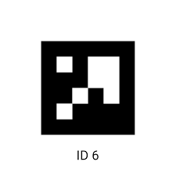

# AprilTags and PhotonVision
## What are Apriltags?
AprilTags are a type of fiducial marker, which are markers that can be used to find the position of an object. They are a type of QR code, and can be read by cameras to find a robot's location.

## How does PhotonVision work?
[PhotonVision](https://photonvision.org/) is a vision processing library that can be used to find the position of an object on the field. It uses a camera to find the position of an AprilTag which is processed by a co-processor (like a Raspberry Pi or an Orange PI). Those values are sent to the roborio through a [network table](https://docs.wpilib.org/en/stable/docs/software/networktables/networktables-intro.html).

These values can then be used to find the position of the robot on the field through a set of strategies that use the NetworkTable values (read through PhotonLib, PhotonVision's library for WPIlib). The most common ones are `LOWEST_AMBIGUITY`, `AVERAGE_BEST_AMBIGUITY`, and `MULTI_TAG_PNP`. These strategies can be found in the [PhotonVision documentation](https://docs.photonvision.org/en/latest/docs/programming/photonlib/robot-pose-estimator.html).

## Benefits of PhotonVision and Apriltags

* **It is very accurate.** By using Apriltags and PhotonVision, the position of the robot can be found to within a few centimeters.
* **It doesn't compound over time.** Unlike Odometry, this method of position-finding does not get worse the longer the robot is driven. This means that it can be used as a primary position-finding method.
* **It works in any lightning conditions.** This method of position-finding does not require any special lighting, hence it doesn't require as much tuning at competition.

## Limitations of Apriltags and PhotonVision

* **It is highly dependent on seeing Apriltags.** If none of the cameras can see an Apriltag, the robot won't know its position solely from Apriltags. This means that it should be used in combination with another position-finding method (in this case, Odometry).
* **It is slow.** PhotonVision only has around 7-10fps for each cameras, so there is time between frames where we don't have absolute positioning.

## How to use Apriltags and PhotonVision
Use the `getPose3d()` method that outputs a `Pose3d` object. This object contains the position of the robot in the field, as well as the rotation of the robot (but it shouldn't be used due to the way angle averages work). This can be used to find the position of the robot on the field. 

### Initialization
To initialize PhotonVision, use the constructor `PhotonVision()`. It doesn't require any parameters as all of the constants should already be set in the `CameraConstants.java` file.

### Runing PhotonVision
There is no need to continuously run PhotonVision, as it is already running in the background on the co-processor. When calling getPose3d(), PhotonVision will automatically get the latest values from the network table.

### Integrating PhotonVision/Apriltags with other Position-Finding Methods
To integrate PhotonVision with other position-finding methods, use the `getPose3d()` method. This method will return a `Pose3d` object, which contains the position of the robot on the field. This can be used to set the "true" position of the robot (either directly or throught a Kalman Filter).
