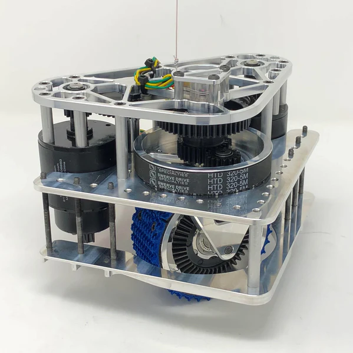

# Swerve Drive

## What is swerve drive?

Swerve drive is a type of drive train that allows for independent control of each wheel. This allows for the robot to move in any direction, and rotate in place. It also allows for the robot to move sideways or rotate while moving linearly, which is useful for some games.

## How does swerve drive work?

Swerve drive works by having each wheel connected to a motor that can rotate 360 degrees. Each wheel has a steering and a driving motor. The steering motor rotates the wheel, and the driving motor rotates the wheel and the robot.

Here is an example of a swerve drive module (mk4i):

As you can see, there are 2 motors which control the orientation and speed of the wheel. There is also an absolute encoder that allows the robot to know the orientation of the wheel even after it is fully turned off.

When 4 of these modules are connected to a robot, it can move in any direction and rotate in place by using vector addition.

Strafing is the process of moving in 2 dimentions by orienting all of the wheels at the same angle and moving them at the same speed.

Rotating is the process of rotating in place by orienting all of the wheels at 90 degrees angles from each other and then turning them at the same speed.

When strafing and rotating are done at the same time, we get a vector sum of the two vectors for each wheel (speed is a magnitude while orientation is well, orientation). Since rotatin and strafing are going to be different for each wheels, the robot is able to move while rotating.

One caveat is that the added vectors could be greater than 1, there, we need to scale all of the vectors down.

## Benefits of swerve drive

* **Agility.** Because swerve can move in any directions and rotate, it is very easy to avoid defense from other robots. It is also easier to move around the field and score points for most objectives.
* **Modular.** Because swerve drive modules are modular, the robot is easily repairable It is also possible to drive the robot with only 3 modules working (if one module is broken during a match for example).

## Limitations of sweve drive

* **Very complex.** Because of the complex nature of swerve drive, the code is to read or understand. Moreover, the chance of something going wrong is high.
* **Draws a lot of power.** Swerve drive uses 8 motors at once, which draw a lot of power, it is **nessessary** to prepare the amount of amps drawn by each motor on the robot.

## How to use swerve drive

Call the `swerveDrive` procedure in the `Drive` mechanism. This procedure takes 3 parameters:

* `x` - The x component of the vector to move in.
* `y` - The y component of the vector to move in.
* `rotation` - The amount to rotate the robot.

You can also inpute a pointDir, but this should only be used for `FollowPoints`.
### Initialization

Calling `Drive()` will initialize the mechanism. This will initialize the motors and the encoders.

### Running swerveDrive

To use the mecanism, call the `swerveDrive` method. You can simply use joysticks as inputs. 
No procedures are needed for swerve, all is containted in the `Drive.java` mechanism.

### Integrating Mechanism with other code

Thanks to the option to add a pointDir in the method `swerveDrive`, it is possible to use swerve drive with `FollowPoints` (or another procedure).